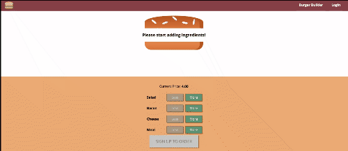

# Burger-Builder
This is a course project for a Udemy course, React 16 - The Complete Guide (incl. React Router 4 and Redux), by Maximilian Schwarzmüller. The app simulates the basic process of building and ordering a hamburger from a burger joint. Utilizing Reactjs (now with Hooks), Redux (now with Saga), Jest & Enzyme for testing, and Firebase for the backend and authentication.

### Refactoring TO-DO
* Restyling for added UX